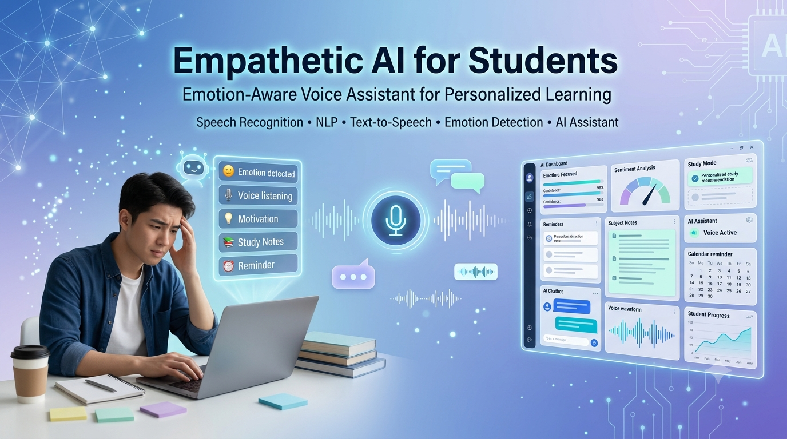

<p align="center">
  
</p>

<h1 align="center">🧠 Empathetic AI for Students</h1>

<p align="center">
An Emotion-Aware Voice Assistant for Personalized Learning and Student Well-Being
</p>

<p align="center">
  
  
  
  
  
  
</p>

---

# 📖 Overview

Empathetic AI for Students is an AI-powered voice assistant designed to make learning more personalized by combining academic assistance with emotional awareness.

Unlike traditional study assistants that only answer questions, this system analyzes the user's emotional state from voice or text input and responds with motivational support before providing study material. The assistant also retrieves educational content, formulas, and notes, helping students remain focused and emotionally supported throughout their learning sessions.

The project is especially intended to assist students who experience stress, anxiety, or difficulty maintaining concentration during study sessions.

---

# ✨ Features

- 🎤 Voice-based interaction using Speech Recognition
- ⌨️ Text-based query support
- 😊 Emotion detection from user input
- 💬 Personalized motivational responses
- 📚 Wikipedia-powered study notes retrieval
- 📐 Formula suggestions for common academic topics
- 🔊 Hands-free learning experience
- 📈 Study session tracking and progress monitoring
- 💡 Interactive command-line assistant

---

# 🏗️ System Workflow

```

User Voice / Text Input
│
▼
Speech Recognition (if voice)
│
▼
Emotion Detection
│
▼
Motivational Response
│
▼
Topic Identification
│
▼
Formula Lookup
│
▼
Wikipedia API
│
▼
Study Notes Generation
│
▼
Student Output

```

---

# 🛠️ Technologies Used

| Category | Technologies |
|----------|--------------|
| Programming Language | Python |
| AI / NLP | Hugging Face Transformers |
| Emotion Detection | BERT Emotion Classification |
| Voice Recognition | SpeechRecognition |
| APIs | Wikipedia REST API |
| Console UI | Colorama |
| HTTP Requests | Requests |

---

# 📂 Repository Structure

```

Empathetic-AI-For-Students
│
├── code/
│ ├── try5.py
│ ├── try6.py
│ └── try7.py
│
├── images/
│ └── banner.png
│
├── paper/
│ └── Minor_Project_Report.pdf
│
├── presentation/
│ └── PPT.pptx
│
├── README.md
└── requirements.txt

```

---

# ⚙️ How It Works

1. The user interacts with the assistant using voice or text.
2. Voice input is converted into text using Speech Recognition.
3. The assistant analyzes the emotional tone of the input using a transformer-based emotion classification model.
4. If stress, sadness, fear, or similar emotions are detected, motivational guidance is provided.
5. The assistant identifies the requested study topic.
6. Relevant formulas are displayed when available.
7. Educational summaries are retrieved from the Wikipedia API.
8. The assistant presents personalized learning support and study material.

---

# 🎯 Key Capabilities

- Emotion-aware academic assistance
- Voice-enabled learning
- Personalized encouragement
- Formula lookup
- Study note generation
- Educational content retrieval
- Progress tracking
- Simple and user-friendly interaction

---

# 🚀 Future Enhancements

- 🎥 Facial expression analysis for multimodal emotion detection
- 🧠 Integration with Large Language Models (LLMs)
- 📅 Smart study planner with calendar synchronization
- 🌍 Multilingual voice support
- 📱 Mobile application deployment
- ☁️ Cloud-based user profiles and progress tracking
- 📊 AI-powered learning analytics dashboard

---

# 📄 Project Report

The complete project documentation is available in:

```

paper/Minor_Project_Report.pdf

```

The report includes:

- Problem Statement
- Literature Review
- Proposed Methodology
- System Architecture
- Implementation
- Results
- Future Scope

---

# 📊 Presentation

Project presentation:

```

presentation/PPT.pptx

```

---

# 📦 Installation

Clone the repository:

```bash
git clone https://github.com/yourusername/Empathetic-AI-For-Students.git
```

Install dependencies:

```bash
pip install -r requirements.txt
```

Run the assistant:

```bash
python code/try7.py
```

---

# 👩‍💻 Authors

**Kavya Spoorthi**

Department of CSE (Artificial Intelligence & Machine Learning)

B V Raju Institute of Technology

---

# 🌟 Acknowledgement

This project was developed as part of the **B.Tech Minor Project** under the guidance of the faculty members of the Department of CSE (Artificial Intelligence & Machine Learning), B V Raju Institute of Technology. :contentReference[oaicite:2]{index=2}

---

# ⭐ Support

If you found this project interesting, consider giving it a ⭐ on GitHub.
